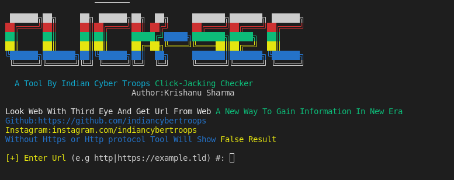

# click-sec.sh
## Click-Sec Is clickjacking vuln testing tool
### What is Click Jacking:
Clickjacking is an attack that tricks a user into clicking a webpage element which is invisible or disguised as another element. This can cause users to unwittingly download malware, visit malicious web pages, provide credentials or sensitive information, transfer money, or purchase products online.
#### How This Tool Detect Vuln:
Enter Website into tool With Https or Http protocol This tool will check vuln if website is vuln then it will show vulnerable if not then Not Vulnerable 
##### Click-Jack Poc Generator is also Added into this tool & its automated 
### Warning: Dont Change Anything In tool Otherwise Tool Will Remove Itself And It will Corrupt Your System And We Are Not Responsible For Any Damage Caused By Tool
## Designed By : K. Sharma
<p>
 <a href="https://www.youtube.com/c/indiancybertroops">
    
  </a>
    <a href="https://instagram.com/indiancybertroops">
    
  </a>
     <a href="https://t.me/indiancybertroops">
    
  </a>

</p>
   
   
### Team Indian Cyber Troops:
>Created By : Krishanu Sharma 

# Features:
>Easy to Install

>Easy to Use

>Designed In Bash(shell scripting)

>Easy To Execue

>Fastest (Based On Internet Speed)

>Low Bandwith/Data Consume
>to find ClickJacking Vuln
>Without Brutforce(To save your valuable Time) 
# Main Click-Sec Image

# Installation :
> clone via git clone

```
git clone https://github.com/indiancybertroops/click-sec
```
```
cd click-sec
```
```
chmod +777 *
```
```
sudo bash click-sec.sh
```


# Github Status
[](https://github.com/indiancybertroops "Stats")<br>

## Contact Us: 


>Instagram
https://instagram.com/krishanuIND
>Instagram
https://instagram.com/Indiancybertroops


>Twitter
https://twitter.com/krishanuIND
